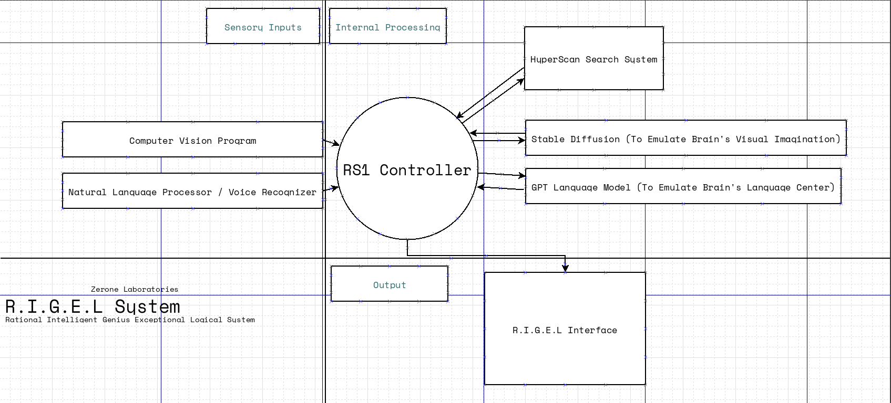

# Project RS1
Reality Synthesizer Mark 1
ZRNLBS

Incomplete Project !

> Project Outline

A Centralized program which will bridge Machine Learning Networks (Generative Pre-trained Transformers, Natural Language Processing, Computer Vision, Voice Recognition) and also will read sensory inputs (Visual/Audio) and emulate the "Theory of Mind," a basic version of human consciousness.

> Explanation

To understand this, we should observe how the consciousness works.

The Philosophical theory *Empiricism* States that
"All human knowledge and intelligence is derived from sensory inputs"
I'd like to add a little addition to this statement.
"Human Knowledge, Ideas and Why/What questions are a result of sensory inputs".

Let's build up some hypothetical scenarios in order to understand the link between sensory inputs and the conscious decisions...

- Suppose you walking down alone in the street and saw this beautiful view of the sunset and decided to take a picture of that.  **Who told you  to do that ?** No one, its an idea **that was popped in to your head because you *saw* it**. If you did not see the sunset, you will not take a picture of that.

- Almost everyone has touched something hot and burned some part of their body in their life at least once. Because of this **experience** that is derived from the sensory input **Pain**, you would refrain from touching hot stuff.

- A human child will ask questions constantly because they are new to this world. When they **See** Something new or **Hear** a word that is unfamiliar to them, they tend to ask **Why or What**.

This is because unlike current AI systems, the brain gets sensory inputs constantly, and every system (Language, Vision, Hearing, Touch) is connected or bridged to each other.

The aim of the project RS1 is to emulate these functions to build a basic model of human consciousness.

> R.I.G.E.L System

